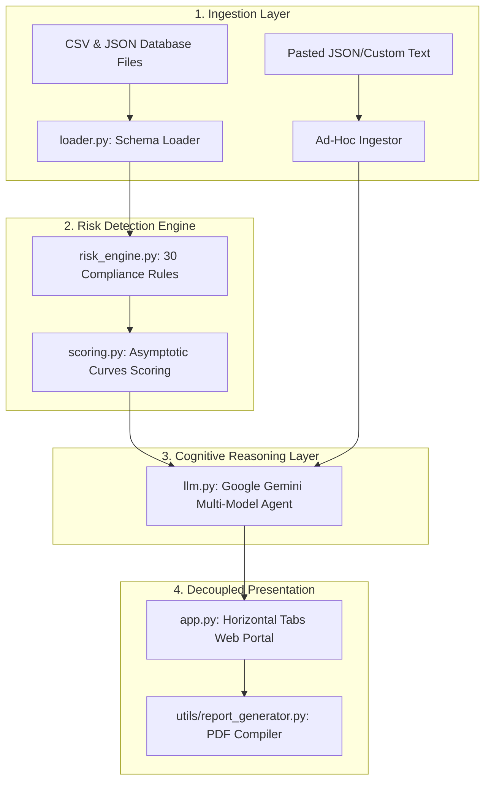

# Financial Risk Signal Aggregator (AI Audit Command Center)

An enterprise-grade financial risk scoring and compliance audit prototype designed to ingest structured and unstructured datasets, run automated transaction monitoring rules, prioritize compliance queues, and compile AI-powered compliance narrative case files.

---

## 1. Our Ingestion & Risk Scoring Approach

Our prototype aggregates fragmented signals (relational transactions, login history, PEP checks, watchlist databases, and adverse news events) into a unified compliance view using a multi-layered detection pipeline:



### Risk Detection & Analysis Workflow
1. **Normalization & Verification**: Ingests core relational schemas, verifying integrity constraint criteria (e.g., account balance constraints, transaction sequence references).
2. **Automated Rule Evaluation**: Processes customer records through a catalog of **30 specialized regulatory compliance rules** (covering transaction structuring, VPN geolocation hops, high-risk merchant categories, sanctions countries, and adverse news sentiment metrics).
3. **Prioritized Risk Scoring**: Risk scores are calculated using a custom **asymptotic weight-accumulation curve** combined with a deterministic, client-specific tie-breaker offset. This ensures high-risk clients receive distinct, unique floating-point risk scores (e.g. `99.38/100`, `98.91/100`) rather than flat-capping at `100.0`, enabling accurate queue ordering.
4. **Ad-Hoc Zero-Shot AI Audit**: Direct text inputs or custom uploaded CSV logs bypass pre-computed tables and are processed by Gemini using zero-shot prompt heuristics to detect compliance flags on the fly.
5. **Dynamic Model Resolution**: Prompts are sent to an auto-model failover chain that dynamically queries active Google generative model configs (e.g. `gemini-3.5-flash`, `gemini-2.0-flash`) in the background, ensuring uninterrupted audit generation.

---

## 2. Tools & Platforms Used

* **Language**: Python 3.13
* **Data Processing & Analytics**: Pandas, NumPy
* **Mock Data Generation**: Faker (relational transaction seeds)
* **Visualization Dashboard**: Streamlit (horizontal tabs layout, custom CSS cards), Plotly Express
* **Cognitive Reasoning Engine**: Google Gemini API (`google-generativeai` client library)
* **Reporting & Exports**: ReportLab PDF compilation engine, CSV generation
* **Quality Assurance**: Pytest (integrity checks, schema validations)

---

## 3. Data Assumptions

1. **Relational Constraints**: Customers hold multiple accounts; transactions connect accounts to merchants. Watchlists, devices, and session login files must maintain strict foreign key relationships to `customer_id`.
2. **Transaction Structuring Threshold**: Cash withdrawals or deposits occurring under the regulatory $10,000 threshold (typically $9,000–$9,999) inside short intervals (e.g., within 24 hours) are assumed to indicate structured evasion of reporting requirements.
3. **Impossible Travel Velocity**: Logins from geographically separate coordinates within intervals physically impossible to fly indicate account takeovers, browser hijackings, or credential sharing.
4. **Sanction Country Proximity**: Customers domiciled in, or conducting transactions with beneficiaries in sanctioned jurisdictions (e.g., North Korea, Iran, Russia) present direct compliance liabilities.
5. **Adverse News Sentiment**: Customer references in media logs containing negative sentiment values (< -0.4) indicate reputational risks.

---

## 4. Input & Output Example (Ad-Hoc Ingestor)

### Sample Input Payload (Pasted JSON Text)
```json
{
  "customer_id": "CUST-TEMP-9981",
  "full_name": "Marcus Vance",
  "pep_status": "No",
  "residence_country": "United States",
  "recent_transactions": [
    {"time": "2026-07-25 10:15", "amount": 9950, "merchant": "Local Deposit ATM", "location": "Miami, FL", "status": "COMPLETED"},
    {"time": "2026-07-25 10:22", "amount": 9800, "merchant": "Local Deposit ATM", "location": "Miami, FL", "status": "COMPLETED"},
    {"time": "2026-07-25 10:45", "amount": 9900, "merchant": "Local Deposit ATM", "location": "Miami, FL", "status": "COMPLETED"}
  ]
}
```

### Corresponding Output Summary (Parsed AI Audit Report)
```markdown
### calculated_risk_score: 88.5
### calculated_risk_level: CRITICAL

#### 1. EXECUTIVE SUMMARY
Ad-hoc audit evaluation completed for custom input logs. Entity exhibits indicators matching CRITICAL severity risk.

#### 2. RISK EXPLANATION & DETECTED SIGNALS
- **Evasion of AML Limits**: High frequency of structured deposits just under the $10,000 reporting threshold.
- **BSA evasion**: Direct patterns of split transaction activities.

#### 3. REGULATORY IMPACT & REASONING
Evasion of currency transaction reporting requirements directly violates 31 U.S.C. 5324 (BSA structuring provisions).

#### 4. RECOMMENDED IMMEDIATE ACTION
File a Suspicious Activity Report (SAR) with FinCEN within 30 days and restrict transaction velocity.
```

---

## 5. Setup & Running Instructions

### 1. Ingest Database & Seed Fraud Patterns
```bash
python generate_data.py
```
This builds and populates all database tables inside `data/generated_data/`.

### 2. Verify System Logic (Pytest)
```bash
python -m pytest
```

### 3. Launch interactive Dashboard
```bash
streamlit run app.py
```
This opens the browser client (typically at `http://localhost:8501`).
